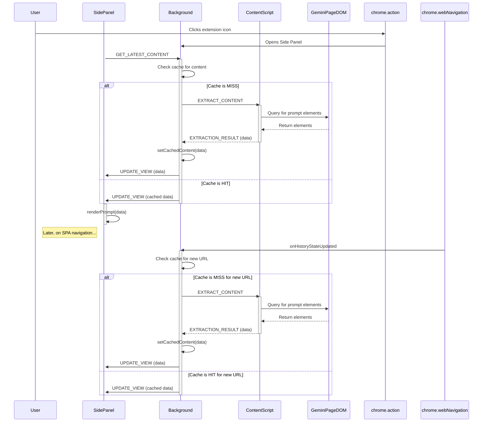

# Data Flow and Interaction Diagram

This document outlines the data flow between the core components of the Gemini Prompt Extractor extension: the Side Panel, the Background Script, and the Content Script.

## Key Interaction Flows

### 1. Initial Content Extraction (Side Panel Opening)

1.  **User Action**: The user clicks the extension's icon in the toolbar.
2.  **Side Panel Opens**: The background script, listening for this action, opens the side panel.
3.  **Request Content**: Upon loading, the `sidepanel.ts` script sends a `GET_LATEST_CONTENT` message to the background script.
4.  **Cache Check**: The background script checks its session storage to see if content for the current URL has already been cached.
5.  **Extraction Trigger**:
    *   **If Cache Miss**: The background script injects the content script (if not already present) and sends an `EXTRACT_CONTENT` message.
    *   **If Cache Hit**: It skips extraction and proceeds to step 8.
6.  **Content Scraping**: The content script receives the message, uses `GeminiExtractor` to query the Gemini page's DOM, and extracts the relevant prompt data.
7.  **Data Return**: The extracted data is sent back to the background script in an `EXTRACTION_RESULT` message.
8.  **Caching & View Update**: The background script caches the new data in session storage and then forwards it to the side panel in an `UPDATE_VIEW` message.
9.  **Render**: The side panel receives the data and dynamically renders the prompts.

### 2. SPA Navigation

Because Gemini is a Single-Page Application (SPA), navigating between chats doesn't trigger a full page reload. The extension handles this using the `webNavigation` API.

1.  **Navigation Event**: The background script listens for `onHistoryStateUpdated`, which fires when the URL changes within the Gemini app.
2.  **Cache Check**: It immediately checks for cached content associated with the new URL.
3.  **Re-extraction**: If the cache is empty for the new URL, it triggers a new extraction cycle (steps 5-9 from the initial flow).
4.  **Update View**: If content is found in the cache or after a successful re-extraction, it sends an `UPDATE_VIEW` message to the side panel to refresh the displayed prompts.
