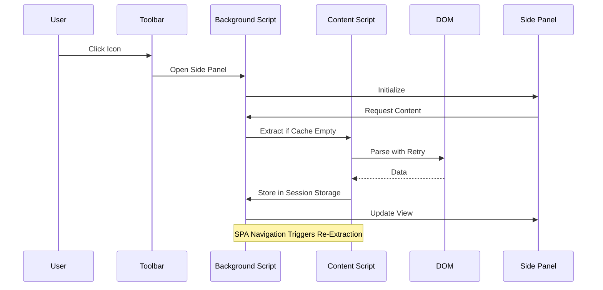

# **Technical Design Document: Chrome Extension - Side Panel Content Extractor (Revised)**

## 1. Overview

A Chrome Extension that extracts and displays webpage content from the **Gemini** web app in a browser side panel. Built with **TypeScript** and following **Manifest V3** guidelines, it is designed for **SPA-aware extraction**, robust error handling, and maintainability, now enhanced for production-readiness with comprehensive interfaces, scalability measures, and risk mitigations.

---

## 2. Project Stack

* **Language**: TypeScript
* **Bundler**: **Vite** (preferred for its superior build speed and hot module replacement, facilitating faster development iterations; fallback to Webpack if legacy compatibility is required)
* **Linting/Formatting**: ESLint + Prettier
* **Testing**:

  * Unit testing: Jest
  * E2E testing: Playwright for DOM extraction validation

**Directory Structure**

```
/dist
    background.js
    content.js
    sidepanel.js
    sidepanel.html
    sidepanel.css
    /assets
        icon16.png
        icon48.png
        icon128.png
/src
    /ts
        background.ts
        content.ts
        sidepanel.ts
        /extractors
            geminiExtractor.ts
            index.ts
    /shared
        types.ts
        messages.ts  // Centralized message type registry
        config.ts    // URL patterns, selectors
/static
    sidepanel.html
    sidepanel.css
    manifest.json
    /assets
        {...}
/vite.config.js or /webpack.config.js
/tsconfig.json
/README.md
```

**Setup and Version Control Best Practices**

* Use npm or yarn for dependency management to ensure reproducible builds.
* Include a `.gitignore` file to exclude `/dist`, `node_modules`, and temporary files, preventing repository bloat.
* Commit changes with semantic versioning (e.g., via Conventional Commits) to facilitate maintainable collaboration and release tracking.

---

## 3. System Architecture

**Components**

1. **Content Script (`content.ts`)** – Runs in webpage context, extracts DOM data via pluggable extractors.
2. **Background Script (`background.ts`)** – Orchestrates communication, state management, and SPA detection.
3. **Side Panel (`sidepanel.ts`, `.html`, `.css`)** – Displays extracted content with reactive updates.

**SPA-Aware Flow**

* Uses `chrome.webNavigation.onHistoryStateUpdated` for URL changes.
* Delays extraction until **DOM readiness polling** confirms target elements are available.

**Architecture Diagram**



---

## 4. Data Flow

### **Standard Extraction**

1. User clicks toolbar icon.
2. Background script opens side panel.
3. Side panel requests latest content.
4. If cache empty → background requests content script extraction.
5. Content script uses extractor to parse DOM (with retry/backoff).
6. Result stored in `chrome.storage.session` with size limits (e.g., evict oldest entries if exceeding 5MB using LRU policy via custom indexing).
7. UI updated with `UPDATE_VIEW` message.

### **SPA Navigation**

1. URL changes detected.
2. Background triggers new extraction after DOM readiness, throttled to 1 per 500ms using debounce to prevent overload during rapid navigations.
3. Same steps as above, updating both cache & UI.

---

## 5. Pluggable Extraction Design

* Extraction logic stored in `/extractors` folder.
* **Strategy Pattern**: Each extractor implements `IExtractor` interface:

```ts
interface IExtractor {
  canHandle(url: string): boolean;
  extract(): Promise<{ status: 'success', data: { prompts: string[], metadata: { timestamp: Date } } } | { status: 'error', message: string }>;
}
```

* Future sites can be added without modifying `content.ts`.

---

## 6. Configurable Selectors & URL Patterns

`/shared/config.ts` contains:

```ts
export const URL_PATTERNS = ["https://gemini.google.com/app/*"];
export const SELECTORS = {
  gemini: ".chat-content",
};
```

This allows quick updates when DOM or site patterns change.

---

## 7. Robustness Features

* **Retry with exponential backoff** (initial delay: 100ms, multiplier: 2, max 3 attempts) if DOM not ready or extraction fails.

```ts
// Pseudocode for retry logic in content script
async function extractWithRetry(extractor: IExtractor, maxRetries: number = 3): Promise<ExtractionResult> {
  let attempt = 0;
  let delay = 100; // ms
  while (attempt < maxRetries) {
    try {
      return await extractor.extract();
    } catch (error) {
      attempt++;
      if (attempt >= maxRetries) throw error;
      await new Promise(resolve => setTimeout(resolve, delay));
      delay *= 2;
    }
  }
}
```

* **Error UI** in side panel for failed extractions.
* **Loading state** to improve UX.
* **Graceful fallback** if no extractor matches current URL, including handling edge cases such as 'activeTab' permission denials (prompt user via UI) or cross-origin restrictions (use declarativeNetRequest for CSP bypass where applicable).

---

## 8. Message Passing Interface (Centralized)

Located in `/shared/messages.ts`:

```ts
export const MESSAGES = {
  GET_LATEST_CONTENT: "GET_LATEST_CONTENT",
  EXTRACT_CONTENT: "EXTRACT_CONTENT",
  EXTRACTION_RESULT: "EXTRACTION_RESULT",
  UPDATE_VIEW: "UPDATE_VIEW"
} as const;

// Payload types for messages
type MessagePayloads = {
  [MESSAGES.GET_LATEST_CONTENT]: { tabId: number };
  [MESSAGES.EXTRACT_CONTENT]: { url: string };
  [MESSAGES.EXTRACTION_RESULT]: { status: 'success', data: { prompts: string[], metadata: { timestamp: Date } } } | { status: 'error', message: string };
  [MESSAGES.UPDATE_VIEW]: { content: string };
};
```

Payloads remain as per original design but now all message keys are in one file for maintainability, with explicit TypeScript types for payloads to ensure type-safe communication.

---

## 9. Non-Functional Requirements

* **Performance**: Extraction < 500ms for standard pages; monitor via Chrome runtime API metrics, with benchmarks for rapid SPA scenarios (e.g., <1s average under 10 navigations/min).
* **Security**:

  * Strict Content Security Policy in `manifest.json`.
  * No remote script execution.
  * Use optional permissions (e.g., 'activeTab') to mitigate denial risks.

* **Accessibility**: Ensure WCAG 2.1 compliance in side panel UI, including ARIA labels for dynamic content and keyboard navigation support.
* **Internationalization**: Support via Chrome's `i18n` API for multi-language strings in UI elements.
* **Testing**:

  * Jest unit tests for extractors.
  * Playwright tests for SPA navigation handling.

---

## 10. Future Enhancements

* **Incremental DOM diffing** for faster SPA updates (addresses current polling overhead; dependency: Integrate MutationObserver; effort: Medium, ~2 weeks).
* **Multiple site support** via extractor registry (builds on pluggable design; priority: High; effort: Low, ~1 week).
* **Developer debug panel** in side panel for real-time logging (mitigates maintainability gaps in debugging; dependency: Existing message interface; effort: Low, ~3 days).